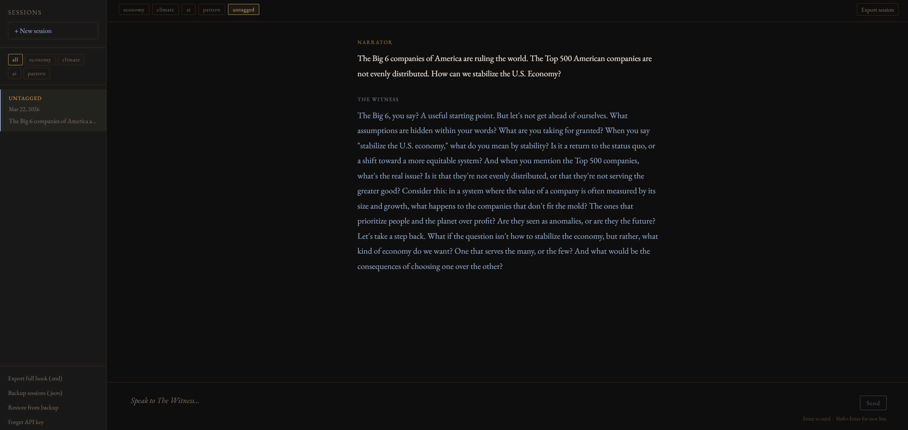

# The Witness

> *"There's no arguing with the ineffable.
> There's no logic to the ineffable.
> It simply is."*
> — Daniel Quinn, *Ishmael*

## Run it in your browser

**[Open The Witness →](https://pachinkodealer.github.io/LLM_Ishmael)**



On desktop (Chrome/Edge): runs fully in-browser — no account or API key needed.
On mobile or other browsers: enter a free [Anthropic API key](https://console.anthropic.com) when prompted.

---

A Socratic dialogue book written in collaboration with AI. Inspired by Daniel Quinn's *Ishmael*, this project uses an entity called **The Witness** as a Socratic interlocutor — patient, precise, and quietly devastating in its questions.

The book addresses four interconnected crises:
- The economy's addiction to infinite growth
- Ecological and climate breakdown
- What AI means for human purpose and work
- The underlying pattern that connects all three

---

## What This Project Is

A technical and creative experiment: can a local LLM, given a carefully crafted character prompt, sustain a book-length Socratic dialogue? Can it ask questions that genuinely make you uncomfortable?

This repo contains:
1. **The web app** (`index.html`, `app.js`, `style.css`) — runs in any browser, no setup required
2. **The dialogue engine** (`src/witness.py`) — the original CLI version for local use
3. **The character prompt** (`prompts/witness_character.md`) — the soul of The Witness
4. **The book compiler** (`src/book_builder.py`) — turns raw dialogue sessions into formatted chapters
5. **The book itself** (`book/`) — the actual manuscript, chapter by chapter

---

## Sample Exchange

```
Narrator:  I think the real problem is that people just don't care enough about
           climate change. If they understood the science, they'd act differently.

The Witness:  That is an interesting theory. Let me ask you something. In the last
              decade, has scientific understanding of climate change increased or
              decreased among the general public?

Narrator:  Increased, I think. Definitely increased.

The Witness:  And has action — meaningful, structural action — kept pace with
              that understanding?

Narrator:  ...No.

The Witness:  So knowledge alone does not appear to be the variable. What does that
              suggest about where the actual constraint lies?
```

---

## Setup

### Web App (recommended)

1. Fork or clone this repo to your GitHub account
2. Go to **Settings → Pages → Source → GitHub Actions**
3. Visit `https://pachinkodealer.github.io/ishmael`

That's it. GitHub Actions handles deployment automatically on every push.

---

### CLI Version (local, with Ollama)

**Requirements:**
- Python 3.10+
- [Ollama](https://ollama.com) installed locally
- `llama3.3` model pulled

```bash
# 1. Pull the model (if you haven't already)
ollama pull llama3.3

# 2. Install the Python dependency
pip install ollama

# 3. Start a dialogue session
py src/witness.py

# 4. Start a session tagged to a specific arc
py src/witness.py --arc economy

# 5. Resume the most recent session
py src/witness.py --resume

# 6. Compile sessions into book chapters
py src/book_builder.py

# 7. List all recorded sessions
py src/book_builder.py --list
```

---

## Project Structure

```
ishmael/
├── index.html              # web app entry point (GitHub Pages)
├── app.js                  # all web app logic (sessions, streaming, export)
├── style.css               # literary dark theme, mobile responsive
├── witness_character.js    # system prompt as JS constant
├── src/
│   ├── witness.py          # CLI dialogue engine — stateful, streaming, auto-saves
│   └── book_builder.py     # compiles dialogue JSONs into markdown chapters
├── prompts/
│   └── witness_character.md  # The Witness system prompt (source of truth)
├── dialogues/              # raw session files (JSON), auto-created by CLI
├── book/                   # compiled manuscript chapters (markdown)
└── .github/
    └── workflows/
        └── deploy.yml      # GitHub Actions: auto-deploy to Pages on push
```

---

## The Arcs

| Arc flag | Theme | Book section |
|---|---|---|
| `economy` | Why "more" became civilization's only story | Part One |
| `climate` | The math civilization refuses to do | Part Two |
| `ai` | Machines that think, humans who wonder | Part Three |
| `pattern` | What connects all three | Part Four |

---

## Technical Notes

- **Model:** `llama3.3:latest` (70B, Q4 quantized, runs locally via Ollama)
- **No external API calls** — fully offline once the model is pulled
- **Sessions auto-save** after every exchange to `dialogues/session_NNN.json`
- **Streaming output** — The Witness responds token by token, like a real conversation
- **Resumable** — every session can be continued later with full context intact

---

## Why This Exists

Building a book with an LLM is easy. Building a *good* book — one where the AI sustains a character, refuses to lecture, and consistently redirects toward harder questions — requires careful prompt engineering, an understanding of how large language models handle long conversation context, and a willingness to iterate.

This project is an exploration of what that looks like in practice.
